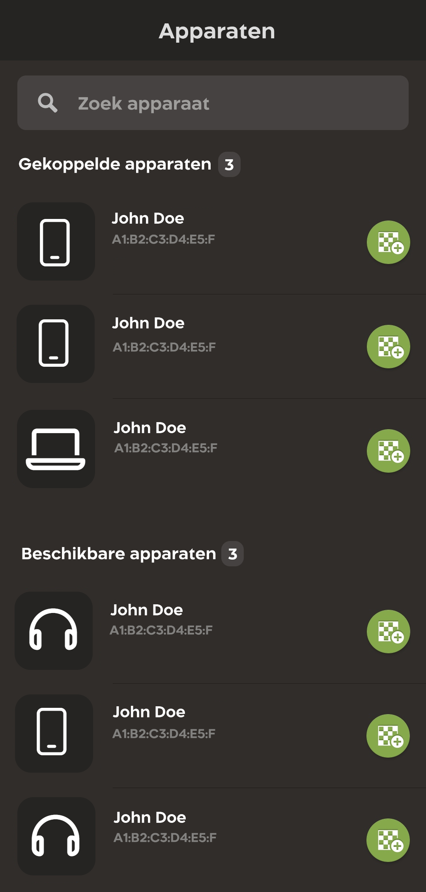
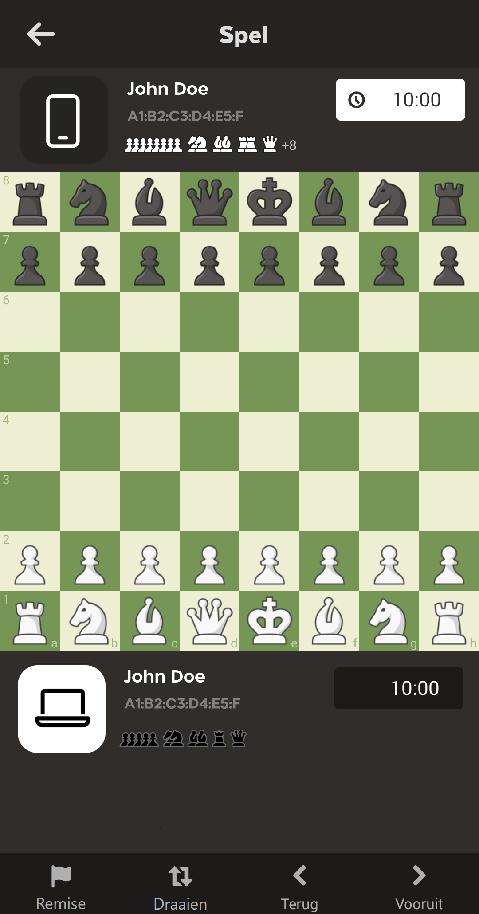

<!-- PROJECT LOGO -->
<br />
<div align="center">
  <a href="https://gitlab.com/SteNaf/bluetoothchess">
    
  </a>

<h3 align="center">Bluetooth Chess</h3>
<div id="badges">
  <a href="https://www.linkedin.com/in/stefan-hilhorst-b7b51223b/">
    
  </a>
</div>
</div>

<!-- ABOUT THE PROJECT -->

## About The Project

Still in development!!!

Airplane rides can be quite boring, and I always wanted to play games with my family/friends. That is why I started this
project, you cannot use Wi-Fi in an airplane (Or it is very bad/expensive). So here is the solution to that problem. I
created an app in which you can play Chess via Bluetooth.

I also believe it is very important to learn new things with each project you start. So this was the first time for me
to work with TypeScript and TailwindCSS.

The designs are based on the Chess.com app and this project is only possible thanks to the '
react-native-bluetooth-classic' library.

### Built With

* [![React-Native][React-Native.js]][React-Native-url]
* [![TypeScript][TypeScript.js]][TypeScript-url]
* [![TailwindCSS][tailwind.css]][tailwind-url]

<!-- GETTING STARTED -->

## Getting Started

### Installation

1. Clone the repo
   ```sh
   git clone https://gitlab.com/SteNaf/bluetoothchess.git
   ```
2. Install NPM packages
   ```sh
   npm install
   ```
3. Build and run the app
    ```sh
    npx react-native run-ios
    
    // or
    
    npx react-native run-android
    ```

<!-- USAGE EXAMPLES -->

## Usage

This is a React Native project that allows you to play chess via Bluetooth. The app is still in development and will be
for some time. Below you will be able to see the designs for the app. The designs are based on the app from Chess.com.

### Device List



### Gameplay



<!-- ROADMAP -->

## Roadmap

- [x] Bluetooth
    - [x] Connect to device via Bluetooth
    - [x] Send/Receive messages via Bluetooth
- [ ] Chess
    - [x] Chess Algebraic notation interpreter
        - [x] Turn string into Move object
    - [ ] Chess logic
        - [ ] Generate moves
        - [ ] Check for check
        - [ ] Check for game end (win/loss/stalemate)

<!-- ACKNOWLEDGMENTS -->

## Acknowledgments

Thanks to all developers who created these wonderful frameworks/libraries/packages!
A special shoutout to all the people who contributed to the 'react-native-bluetooth-classic' package.

* [ReactNative](https://reactnative.dev/)
* [NativeWind](https://nativewind.dev)
* [Font Awesome](https://fontawesome.com)
* [react-native-bluetooth-classic](https://github.com/kenjdavidson/react-native-bluetooth-classic)
* [Chess.com](https://chess.com)

<!-- MARKDOWN LINKS & IMAGES -->
<!-- https://www.markdownguide.org/basic-syntax/#reference-style-links -->

[React-Native.js]: https://img.shields.io/badge/React-Native-20232A?style=for-the-badge&logo=react&logoColor=61DAFB

[React-Native-url]: https://reactnative.dev/

[tailwind.css]: https://img.shields.io/badge/tailwindcss-20232A?style=for-the-badge&logo=tailwind-css&logoColor=61DAFB

[tailwind-url]: https://nativewind.dev/

[TypeScript.js]: https://img.shields.io/badge/typescript-20232A?style=for-the-badge&logo=typescript&logoColor=white

[TypeScript-url]: https://www.typescriptlang.org/
